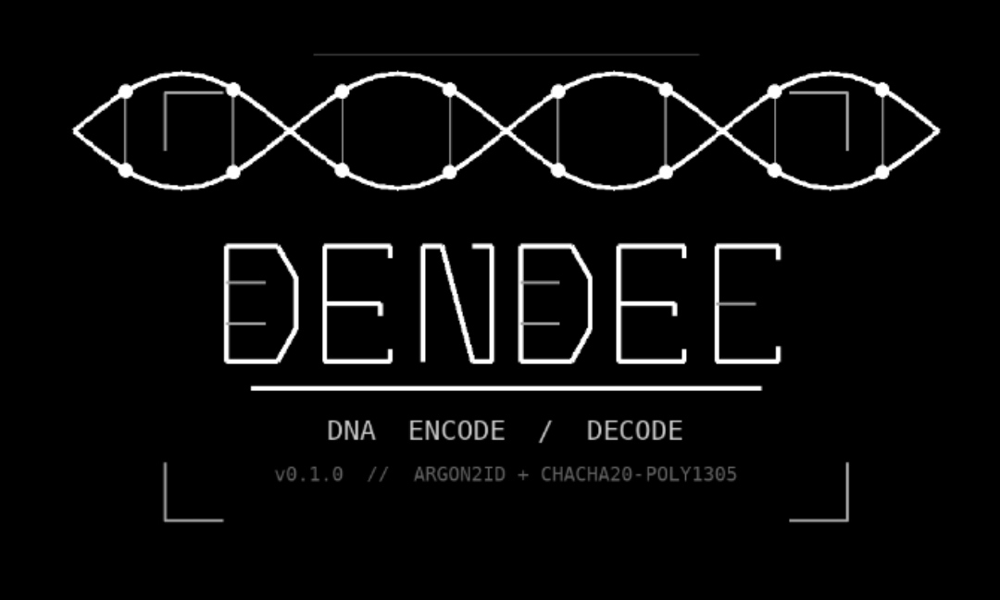

**DNA Encode and Decode** — Password-based encrypted data encoding with genomic steganography. dendec is a CLI tool that transforms any file or text into a sequence of DNA bases (A, T, G, C) using production-grade cryptography, and optionally converts those bases into coordinates pointing to real locations inside the sequenced human genome — making the transmitted artifact indistinguishable from routine bioinformatics research output.

The world's first general-purpose DNA-native encrypted data format, with a fully offline genomic steganography layer built on a pre-computed lookup table derived from the human reference genome hg38.

```
$ dendec encode "Hello, World!"
Enter password:
Confirm password:
Encoding… (Argon2id key derivation may take a moment)
GCATCGATCGGCTAGCATCGATCGGCTAGCATCGATCGGCTAGCAT...

$ dendec refer -r --from message.dna --to annotation_batch7.bed
Loading reference table...
  Read 2048 bases from message.dna
  Mapping 256 8-mers to genome coordinates...
  Written 256 chunks → annotation_batch7.bed
```

> [!IMPORTANT]
> dendec is not a toy. The cryptographic primitives are production-grade. Treat encoded output and passwords with the same seriousness you would any encrypted data.


## What is dendec

Most encryption tools announce themselves. PGP output looks like PGP. AES-encrypted blobs look encrypted. Even conventional steganography hides data in known carrier formats with known detectors.

dendec approaches the problem differently at a fundamental level.

It encodes your data using the vocabulary of molecular biology — A, T, G, C — the same four nucleotide bases that constitute every genome ever sequenced. The raw output is visually and structurally indistinguishable from a DNA sequencing result. No armored headers. No base64 padding. Nothing that registers as ciphertext to any scanner trained on conventional encrypted formats.

With the refer layer active, even the DNA bases disappear. The transmitted artifact becomes a list of coordinates into public human chromosome databases — the kind of annotation file that bioinformatics researchers produce, share on GitHub, and email to colleagues every day. No encrypted data exists in transit. The message is latent inside the sequenced history of life on Earth, recoverable only by someone who holds the correct password and knows where to look.

Under the surface, the cryptography is serious:

- Argon2id key derivation — memory-hard, GPU and ASIC resistant, OWASP and NIST recommended
- ChaCha20-Poly1305 authenticated encryption — simultaneous confidentiality and integrity
- Key-derived DNA alphabet — the base-to-bit mapping itself is derived from the password
- Random salt and nonce per encode — identical inputs never produce identical output
- Self-contained output — salt, nonce, version, and ciphertext all embedded in the sequence itself


## Installation

**From source**

```bash
git clone https://github.com/rudv-ar/dendec
cd dendec
cargo build --release
```

The compiled binary will be at `./target/release/dendec`. It is fully self-contained — the genomic reference table is embedded inside the binary at compile time and requires no external files at runtime.

**Requirements**

Rust 1.75 or later and Cargo. No external C libraries, no system dependencies.

> [!NOTE]
> The `data/table.bin` file must be present in the repository root before compiling, as it is embedded via `include_bytes!` during the build. It is committed to the repository and does not need to be generated by users. If you are building from a fresh clone, it is already there.


## Architecture

dendec is built as three composable layers, each independent of the others, each protecting against a different threat.

**Layer 1 — dendec core**

The cryptographic foundation. Any file or text is encrypted and serialised as a flat string of A, T, G, C characters. This layer owns all security guarantees. The output is the `.dna` file.

**Layer 2 — dendec wrap**

A protocol-agnostic batch transform layer. Intercepts the output of any shell command and applies the core encode or decode pipeline to every appropriate file produced. Enables transparent integration with `git clone`, `curl`, `wget`, and arbitrary shell commands.

**Layer 3 — dendec refer**

A steganographic transport layer that sits on top of the core. It accepts a `.dna` file as opaque A/T/G/C characters and replaces each 8-base chunk with a coordinate pointing to a real location in the human reference genome (hg38), writing a standard BED file. The operation is fully offline — a pre-built lookup table embedded in the binary handles all coordinate translation without network access, without NCBI API calls, and without any external dependencies.

These layers are designed to be composable and independent. The refer layer knows nothing about passwords or cryptography. The core layer knows nothing about genomic coordinates. Breaking one layer does not affect the security guarantee of any other.


## Layer 1 — Core Encode and Decode

### Encoding text

```bash
dendec encode "Your secret message"
```

All Unicode is supported — emoji, CJK characters, Arabic, newlines, tabs, every valid UTF-8 sequence.

### Encoding with grouped output

```bash
dendec encode "Your secret message" --group 10
```

Output is formatted in blocks of 10 bases separated by spaces, which is cosmetic only. The decoder strips whitespace automatically before processing.

```
ATGCATGCAT GCATGCATGC TAGCTAGCAT...
```

### Decoding

```bash
dendec decode "ATGCTAGCAT..."
```

### Encoding a file

```bash
dendec encode --file secret_document.pdf --as secret_document.pdf.dna
```

Reads raw bytes directly from disk. Every byte — including trailing newlines and binary content — is preserved exactly. The output is a `.dna` file containing the flat DNA string.

### Decoding a file

```bash
dendec decode --file secret_document.pdf.dna --as secret_document.pdf
```

Writes raw bytes directly to the output file, byte-for-byte identical to the original.

### Verifying a roundtrip

```bash
dendec encode --file src/main.rs --as main.rs.dna
dendec decode --file main.rs.dna --as restored.rs
diff src/main.rs restored.rs
# no output — perfect roundtrip
```

> [!NOTE]
> The `--as` flag writes output to a named file and prints a confirmation to stderr. Without `--as`, output goes to stdout.

### How it works

**Encode pipeline**

```
Input (text or raw bytes)
    │
    ▼
Argon2id(password, random_salt_128bit)
    ├──► cipher_key      [256 bits — ChaCha20 key]
    └──► mapping_seed    [64 bits  — DNA shuffle seed]
    │
    ▼
Fisher-Yates([A,T,G,C], mapping_seed) ──► permuted DNA mapping
    │
    ▼
ChaCha20-Poly1305(plaintext, cipher_key, random_nonce_96bit) ──► ciphertext
    │
    ▼
Binary packet: [DNDC][v1][salt 16B][nonce 12B][payload_len 8B][ciphertext]
    │
    ▼
2 bits per base, MSB-first, using permuted mapping
    │
    ▼
GCATCGATCGGCTAGC...   (to stdout or --as file)
```

The key-derived permuted mapping is a subtle but important design detail. The four bases [A, T, G, C] are not statically mapped to 2-bit values — they are shuffled via Fisher-Yates using a seed produced by Argon2id. The base-to-bit assignment itself is therefore key-dependent. Without the password, an attacker does not even know which of the 24 possible permutations was used. It adds a second layer of key-dependency on top of the AEAD guarantee.

**Binary header format**

The header is embedded directly inside the DNA sequence as the first 41 bytes, corresponding to the first 164 bases of any dendec output.

```
Offset   Length   Field
0        4        Magic bytes  0x44 0x4E 0x44 0x43  ("DNDC")
4        1        Version      0x01
5        16       Argon2id salt         (random, 128 bits)
21       12       ChaCha20-Poly1305 nonce  (random, 96 bits)
33       8        Payload length        (u64 little-endian)
41       N        Ciphertext            (payload + 16 byte Poly1305 MAC)
```

Everything required for decryption lives inside the DNA string itself. No sidecar files, no external configuration, no key exchange. The sequence is the complete artifact.

**Decode pipeline**

```
DNA string or .dna file
    │
    ▼
Strip whitespace and grouping separators
    │
    ▼
Try all 24 permutations of [A,T,G,C] against the first 164 bases
    │   For each permutation:
    │     decode header bytes → check magic "DNDC"
    │     extract salt → Argon2id(password, salt) → expected mapping
    │     confirm derived mapping matches current permutation
    ▼
Confirmed mapping recovered
    │
    ▼
Decode full DNA string → binary packet
    │
    ▼
Parse header → extract salt, nonce, payload_len
    │
    ▼
Argon2id(password, salt) ──► cipher_key
    │
    ▼
ChaCha20-Poly1305 decrypt and verify Poly1305 MAC
    ├── correct password  → plaintext bytes returned
    ├── wrong password    → MAC mismatch → DecryptionFailed
    └── corrupted data    → MAC mismatch → DecryptionFailed
    │
    ▼
Raw bytes → file (--as) or UTF-8 text → stdout
```

The bootstrap loop tries at most 24 permutations. For each candidate it runs Argon2id once to verify the mapping. In practice the correct permutation is found on the first or second attempt.


## Layer 2 — wrap

`dendec wrap` intercepts the output of any shell command and applies the core encode or decode pipeline to every appropriate file it produces. Directory structure is preserved exactly. Binary files are detected and skipped automatically. One password covers the entire operation — each file still gets its own random salt and nonce internally.

### Encoding a local directory

```bash
dendec wrap -e ./myproject
```

Walks the entire directory tree, encodes every readable file to `.dna` in place, and removes the originals on success.

```
  Scanning ./myproject...

Encoding 15 file(s)...

  Encoding ./myproject/src/main.rs...      ok  (1.8 KB → 7.2 KB)
  Encoding ./myproject/src/lib.rs...       ok  (0.9 KB → 3.6 KB)
  Encoding ./myproject/Cargo.toml...       ok  (312 B → 1.2 KB)
  Encoding ./myproject/README.md...        ok  (4.1 KB → 16.4 KB)
  Skipping ./myproject/assets/logo.png     (binary)

  15 files encoded  |  1 skipped  |  0 failed
```

### Decoding a local directory

```bash
dendec wrap -d ./myproject
```

Walks the directory, finds every `.dna` file, decodes each one back to its original bytes, and removes the `.dna` file on success. The directory is restored to its exact pre-encode state.

### Wrapping a git clone

```bash
# Encode everything produced by a git clone
dendec wrap -e git clone https://github.com/user/repo

# Decode a repository containing .dna files
dendec wrap -d git clone https://github.com/user/repo
```

dendec takes a filesystem snapshot before running the command, runs the command, diffs the snapshot to find exactly what was produced, then encodes or decodes only those files. The clone directory is narrowed automatically so unrelated files in the working directory are not affected.

**Live example — rudv-ar/datatest**

The repository at `https://github.com/rudv-ar/datatest` holds the full dendec source tree in both DNA-encoded and plaintext form side by side. The encoded copy uses the password `rust`.

```bash
# Clone and decode in a single command
dendec wrap -d git clone https://github.com/rudv-ar/datatest
# Enter password: rust
# All .dna files inside datatest/dendec.dna/ are decoded in place
```

```bash
# Or clone first, then decode the directory directly
git clone https://github.com/rudv-ar/datatest
dendec wrap -d ./datatest/dendec.dna
# Enter password: rust
```

```bash
# Verify the decoded output against the plaintext reference
diff -r datatest/dendec.dna datatest/dendec.plaintext
# no output — byte-for-byte identical after decode
```

The datatest repository structure is:

```
datatest/
├── dendec.dna/                       ← full dendec source, DNA-encoded (password: rust)
│   ├── Cargo.lock.dna
│   ├── Cargo.toml.dna
│   ├── data/
│   │   └── table.bin                 ← binary, carried as-is
│   ├── src/
│   │   ├── main.rs.dna
│   │   ├── cli.rs.dna
│   │   ├── crypto.rs.dna
│   │   ├── refer/
│   │   │   ├── chunk.rs.dna
│   │   │   ├── coordinate.rs.dna
│   │   │   ├── mod.rs.dna
│   │   │   ├── reverse.rs.dna
│   │   │   └── table.rs.dna
│   │   └── wrap/
│   │       ├── mod.rs.dna
│   │       └── ...
│   └── tools/build_table/src/main.rs.dna
└── dendec.plaintext/                 ← original source for verification
    └── src/
        └── ...
```

### Wrapping curl

```bash
# curl writes to disk — snapshot detects the file, dendec decodes it
dendec wrap -d curl -o config.toml.dna https://raw.githubusercontent.com/rudv-ar/datatest/main/dendec.dna/Cargo.toml.dna

# curl writes to stdout — dendec captures and decodes the stream directly
dendec wrap -d curl https://raw.githubusercontent.com/rudv-ar/datatest/main/dendec.dna/src/main.rs.dna
```

### What wrap skips automatically

Binary files are detected by content inspection. The first 512 bytes are sampled using the same heuristic git uses. The following are always skipped:

`.git/`, `target/`, `node_modules/`, `.svn/`, `.hg/`, known binary extensions (`png jpg jpeg gif bmp ico webp tiff pdf zip tar gz bz2 xz wasm exe dll so dylib mp3 mp4 wav ogg flac avi mkv mov db sqlite pyc class`), files containing null bytes, and files where more than 10% of the sampled bytes are non-printable.


## Layer 3 — refer

`dendec refer` is a steganographic transport layer. It accepts a `.dna` file — the flat ATGC string produced by `dendec encode` — and replaces each 8-base chunk with a coordinate pointing to a real location inside the human reference genome hg38. The output is a standard BED file: the most common annotation format in bioinformatics, used daily by thousands of researchers, and processable by every major genomics tool including UCSC Genome Browser, bedtools, samtools, and IGV.

An intercepted BED file produced by refer contains no encrypted data, no DNA bases, and no ciphertext. It contains only chromosome accession numbers and genome coordinates. To any observer it is a routine genomics annotation.

### How refer works

**The 8-mer mechanism**

Every 8 bases of DNA represent exactly 2 bytes of source data after encryption (4 bases per byte × 2 bytes = 8 bases). This alignment means no padding, no remainder, and no edge cases. There are 4^8 = 65,536 possible unique 8-mers. The human reference genome hg38 contains 3.2 billion bases. Every possible 8-mer appears thousands of times. Coverage is mathematically guaranteed.

**The lookup table**

A pre-computed lookup table maps every possible 8-mer to multiple coordinates in hg38. Built by scanning chromosome 1 of the human genome (248 million bases), the table contains 65,536 entries with up to 8 coordinate options per 8-mer. It is embedded directly into the dendec binary via `include_bytes!` at compile time, so no external files are needed at runtime and no network calls are ever made.

The 8-mer is used as a direct array index using a fixed base-4 encoding (A=0, T=1, G=2, C=3). This is entirely independent of the key-derived permuted mapping in the crypto layer — refer treats the ATGC string as opaque characters and never interprets their cryptographic meaning.

**The forward and reverse index**

When the table loads at startup, two in-memory indices are built simultaneously:

The forward index maps a base-4 8-mer index to a list of genome coordinates. Used during encoding — each 8-mer chunk is looked up and one coordinate is randomly selected from the available options, ensuring that repeated 8-mers in the DNA produce varied coordinates in the BED output rather than mechanical repetition.

The reverse index maps a coordinate key back to its 8-mer index. Used during decoding — each coordinate in the BED file is looked up and the original 8-mer is recovered in O(1) time.

Both directions are completely offline and instant.

**The BED output format**

```
##dendec-refer v0.1.0
##assembly GCF_000001405.40 hg38
##chunk_size 8
##dna_length 168432
##chunk_count 21054
NC_000001.11    883401    883409    chunk_00000000    0    +
NC_000001.11    19823     19831     chunk_00000001    0    -
NC_000001.11    28401     28409     chunk_00000002    0    +
```

The six columns are the chromosome accession (RefSeq format), start position (0-based, BED convention), end position (always start+8), chunk name for ordering, score (always 0, present for BED compliance), and strand. The `##` header lines are standard in BED, VCF, and GFF formats. A researcher opening this file in IGV, UCSC Genome Browser, or any bioinformatics tool sees a completely normal annotation set.

### Using refer

**Encoding — converting a .dna file to a BED file**

```bash
dendec refer -r --from secret_document.pdf.dna --to annotation_batch7.bed
```

```
Loading reference table...
  Read 168432 bases from secret_document.pdf.dna
  Mapping 21054 8-mers to genome coordinates...
  Written 21054 chunks → annotation_batch7.bed
```

**Decoding — reconstructing a .dna file from a BED file**

```bash
dendec refer -u --from annotation_batch7.bed --to secret_document.pdf.dna
```

```
Loading reference table...
  Read 21054 chunks from annotation_batch7.bed
  Recovered 168432 bases → secret_document.pdf.dna
```

### The complete two-layer pipeline

**Sender**

```bash
# Step 1 — encrypt the source file into a DNA string
dendec encode --file secret_document.pdf --as secret_document.pdf.dna

# Step 2 — convert DNA bases to genomic coordinates
dendec refer -r --from secret_document.pdf.dna --to annotation_GRCh38_batch7.bed

# Step 3 — send annotation_GRCh38_batch7.bed through any channel
# Email it. Post it on GitHub. Put it in a public Gist.
# It looks like a genomics researcher's annotation file.
```

**Recipient**

```bash
# Step 1 — reconstruct the DNA string from coordinates
dendec refer -u --from annotation_GRCh38_batch7.bed --to secret_document.pdf.dna

# Step 2 — decrypt
dendec decode --file secret_document.pdf.dna --as secret_document.pdf
```

**What travels between sender and recipient**

`annotation_GRCh38_batch7.bed` — a file containing nothing but chromosome names and genome position numbers. It contains no ciphertext, no DNA bases, and no dendec headers of any kind. The encrypted data does not exist in transit. The coordinates point to locations inside the publicly sequenced human genome where the relevant sequences happen to appear. The message was always there.

### The two independent security layers

Refer provides steganography — it hides the existence of the message. The core layer provides cryptography — it protects the content of the message. These guarantees are fully independent.

If an adversary intercepts the BED file and identifies it as dendec refer output, they can reconstruct the DNA string. They still cannot decrypt it without the password, because ChaCha20-Poly1305 holds regardless. If an adversary attempts to brute-force the password without identifying the file as suspicious at all, the Argon2id memory-hard KDF makes that computationally prohibitive. Breaking the steganographic layer does not weaken the cryptographic layer. The two are composable and orthogonal by design.


## Security

**Cryptographic primitives**

| Primitive | Role | Rationale |
|---|---|---|
| Argon2id | Password to key | Winner of Password Hashing Competition 2015. Memory-hard. Combines data-dependent and data-independent hardness. Current OWASP and NIST recommendation. |
| ChaCha20-Poly1305 | Encryption and authentication | AEAD construction. Constant-time by design. Mandated in TLS 1.3. Poly1305 MAC ensures any tampering is detected before plaintext is returned. |
| StdRng seeded from key material | DNA mapping shuffle | ChaCha-based CSPRNG. Seeded from Argon2id output. Deterministic given the same key material. |
| rand::thread_rng | Salt and nonce generation | OS-seeded CSPRNG. Fresh 128-bit salt and 96-bit nonce per encode. |

**Argon2id parameters**

| Parameter | Value | Effect |
|---|---|---|
| Memory cost | 65536 KiB (64 MiB) | RAM required per password guess |
| Time cost | 3 iterations | CPU cost multiplier |
| Parallelism | 1 | Single-threaded |

At these parameters, each password guess costs approximately 64 MiB of RAM and one second of wall time. An attacker with substantial hardware resources still faces prohibitive cost against a strong passphrase.

**Threat model**

| Attack vector | Mitigation |
|---|---|
| Wrong password | Poly1305 MAC fails before any plaintext is returned |
| Corrupted or tampered DNA | MAC fails, clean error, no partial output |
| Rainbow table precomputation | Blocked by 128-bit random salt — same password never produces the same key |
| Nonce reuse | Impossible — fresh random nonce generated per encode |
| Mapping brute-force (24 permutations) | Each permutation still hits full ChaCha20-Poly1305 — no shortcut past the KDF |
| Visual identification of ciphertext | Output is valid nucleotide notation, unrecognisable as encrypted data to any conventional scanner |
| BED file identified as refer output | DNA string reconstructed but still protected by Argon2id + ChaCha20-Poly1305 |
| BED file not identified as suspicious | Observer sees standard genomics annotation — no indication encrypted data exists |

> [!CAUTION]
> dendec does not currently zeroize keys and passwords from process memory after use. On shared or compromised systems a memory dump could expose key material. Zeroization via the `zeroize` crate is on the roadmap.

> [!WARNING]
> dendec cannot protect against weak passwords. The strength of Argon2id is irrelevant if the passphrase is guessable. Use a long random passphrase.


## Project Structure

```
dendec/
├── Cargo.toml                        Workspace root, includes tools/build_table
├── data/
│   └── table.bin                     Pre-built hg38 lookup table, embedded at compile time
├── src/
│   ├── main.rs                       Entry point — CLI dispatch and password prompts
│   ├── cli.rs                        clap v4 derive API — subcommand and flag definitions
│   ├── crypto.rs                     Argon2id KDF, ChaCha20-Poly1305, mapping derivation
│   ├── encoding.rs                   Binary header format, full encode/decode pipeline
│   ├── dna.rs                        Bit-level bytes ↔ DNA conversion, grouping utility
│   ├── error.rs                      Unified error enum via thiserror — no panics in production
│   ├── refer/
│   │   ├── mod.rs                    Orchestration — refer_encode and refer_decode entry points
│   │   ├── table.rs                  Embedded table, forward and reverse indices, O(1) lookup
│   │   ├── chunk.rs                  8-mer splitting and reassembly — pure, no I/O
│   │   ├── coordinate.rs             BED format read and write
│   │   └── reverse.rs                Reverse complement utility
│   └── wrap/
│       ├── mod.rs                    Orchestration — local dir, git clone, stdout paths
│       ├── snapshot.rs               Filesystem snapshot and diff
│       ├── classify.rs               Binary detection, skip rules, extension logic
│       ├── transform.rs              Batch encode/decode, per-file progress, summary
│       └── fetch.rs                  Subprocess execution, disk vs stdout detection
└── tools/
    └── build_table/
        └── src/main.rs               One-time table builder — scans hg38, writes table.bin
```

**The table builder**

`tools/build_table` is a separate workspace binary that was run once to produce `data/table.bin`. It is not part of the normal build — end users never run it. It reads gzipped chromosome FASTA files (chr1.fa.gz and chr2.fa.gz from UCSC), slides an 8-mer window across every real base position, and records genome coordinates for all 65,536 possible 8-mers. The resulting binary is 3.1 MB and covers every possible 8-mer with up to 8 coordinate options each, all found within the first 35 million bases of chromosome 1.

The output format (`data/table.bin`) begins with a 4-byte magic string `DRFT`, a version byte, a chromosome accession string table, and then 65,536 sequential entries in base-4 index order. Each entry stores a count byte followed by up to 8 coordinate records of 6 bytes each (1 byte chromosome index, 4 bytes start position, 1 byte strand). The accession strings are embedded in the file header itself, so adding additional chromosomes requires only rerunning the builder with new FASTA sources.


## Dependencies

| Crate | Version | Purpose |
|---|---|---|
| `clap` | 4 | CLI argument parsing via derive API |
| `rpassword` | 7 | Hidden password prompt, no terminal echo |
| `argon2` | 0.5 | Argon2id key derivation |
| `rand` | 0.8 | Cryptographically secure salt, nonce, and random coordinate selection |
| `chacha20poly1305` | 0.10 | ChaCha20-Poly1305 AEAD encryption |
| `thiserror` | 1 | Ergonomic custom error types |
| `walkdir` | 2 | Recursive directory traversal for wrap |
| `tempfile` | 3 | Temporary directories in tests (dev only) |

The table builder additionally uses `flate2` for reading gzipped FASTA files.


## Tests

```bash
cargo test
```

58 tests across seven modules. The test suite takes approximately 120 seconds to complete, which is expected and correct — each encode and decode operation in the encoding tests pays the full Argon2id cost. Reduced test times would indicate the KDF is not functioning as intended.

```
dna::tests                           9 tests   Roundtrip, mapping, validation, edge cases
encoding::tests                      11 tests  Full pipeline, wrong password, corruption, permutations
refer::chunk::tests                  7 tests   8-mer splitting, reassembly, error conditions
refer::coordinate::tests             5 tests   BED read/write, malformed input, ordering
refer::reverse::tests                4 tests   Reverse complement, palindromes, identity
refer::table::tests                  9 tests   Table load, coverage, forward/reverse roundtrip
wrap::classify::tests                7 tests   Binary detection, extension rules, exclusions
wrap::snapshot::tests                3 tests   New file detection, diff, empty directory
wrap::transform::tests               3 tests   File encode/decode roundtrip, utilities
```

The four refer::table tests that exercise the loaded table (`test_table_loads_without_panic`, `test_full_coverage`, `test_lookup_returns_coord`, `test_forward_reverse_roundtrip`, `test_all_kmers_roundtrip`) validate the complete end-to-end refer pipeline including the embedded binary. Full coverage of all 65,536 8-mers is asserted as a test invariant.


## TODO

**Near term**

- [x] `--file` flag — binary-safe file encode and decode
- [x] `--as` flag — write output directly to a named file
- [x] Exact byte preservation including trailing newlines and binary content
- [ ] `--quiet` flag — suppress all stderr output for scripting
- [ ] Richer terminal output — input size, output length, base count, elapsed time

**dendec wrap**

- [x] Local directory transform
- [x] Git repository support
- [x] curl and wget support — disk and stdout modes
- [x] Binary file detection via content sampling
- [x] Excluded directory rules
- [x] Per-file progress reporting with sizes
- [x] Summary report — transformed, skipped, failed
- [ ] `--dry-run` — show what would be transformed without doing it
- [ ] Elapsed time in summary report

**dendec refer**

- [x] Pre-built hg38 lookup table embedded in binary
- [x] Forward O(1) encode — 8-mer to coordinate
- [x] Reverse O(1) decode — coordinate to 8-mer
- [x] Standard BED file output
- [x] Fully offline — no network calls in either direction
- [x] Strand encoding for coordinate variety
- [ ] Optional coordinate variety via multiple chromosome sources
- [ ] `--verify` flag — confirm BED file decodes cleanly before transmitting

**Security hardening**

- [ ] Zeroize keys and password material from memory after use (`zeroize` crate)
- [ ] `--iterations` and `--memory` flags for Argon2id parameter tuning
- [ ] Full timing side-channel audit

**Testing and distribution**

- [ ] CLI integration tests via `assert_cmd`
- [ ] Fuzz testing on the DNA parser and BED parser
- [ ] Cross-platform CI — Linux, macOS, Windows
- [ ] Benchmark suite for Argon2id parameter selection
- [ ] Publish to crates.io
- [ ] Pre-built binaries via GitHub releases
- [ ] Homebrew formula
- [ ] Man page


## Contributing

dendec is in active development. The core, wrap, and refer layers are all stable and fully tested. The binary header format is versioned — any future version of dendec will maintain backward compatibility with sequences encoded by v1. If you are building tooling on top of dendec, the header layout and magic bytes are stable.

Issues and pull requests are welcome.


## License

MIT — see `LICENSE`.


## Philosophy

Make encrypted data indistinguishable from nature.

Not indistinguishable from random noise — indistinguishable from biology. The entire history of life on Earth is written in four characters. Every organism that has ever existed used this alphabet. Every genome database in the world speaks it natively. No security scanner in existence is trained to treat it as a threat vector.

dendec encodes your secrets into that language. An intercepted `.dna` file looks like a fragment from a sequencing run, a slice from a database export, a researcher's working data. An intercepted `.bed` file looks like a genomics annotation — the kind posted as supplementary data in biology papers, shared between collaborators, and committed to public repositories every day.

With refer active, the encrypted data does not exist in transit at all. The transmitted artifact is a list of addresses into the publicly sequenced human genome — 3.2 billion bases of real biological history, distributed across decades of research and stored in public databases. The message is latent inside that history, recoverable only by someone who knows precisely where to look and holds the correct password.

The bases were always there. dendec found them.

